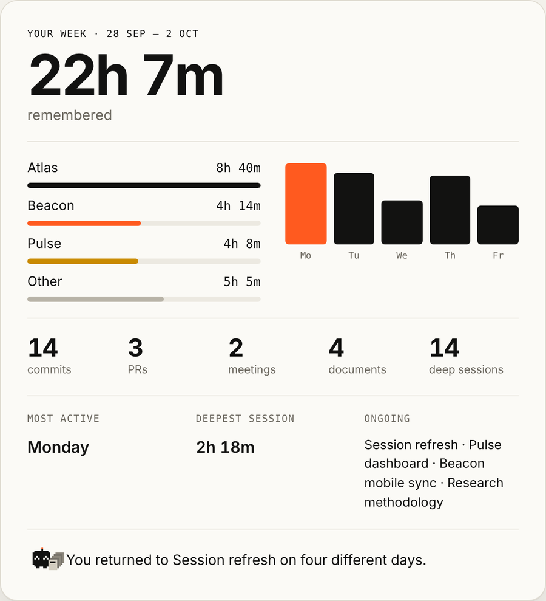
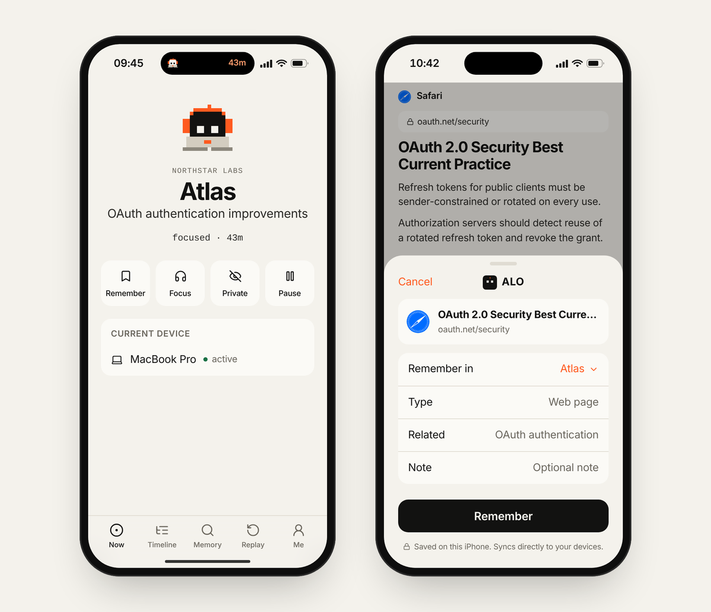
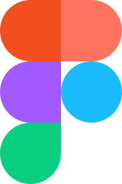
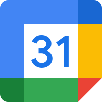

<p align="center">
  
</p>

<h1 align="center">ALO</h1>

<p align="center"><strong>Remember what you did.</strong></p>

<p align="center">A private, local-first memory layer for your digital life.</p>

<p align="center">
  <a href="https://alo-ebon-two.vercel.app/">Website</a>
  &nbsp;·&nbsp;
  <a href="https://github.com/infinitumio/ALO/releases/latest">Download</a>
  &nbsp;·&nbsp;
  <a href="https://github.com/infinitumio/ALO/releases">Releases</a>
  &nbsp;·&nbsp;
  <a href="./docs/privacy.md">Privacy</a>
  &nbsp;·&nbsp;
  <a href="./docs/protocol.md">Developers</a>
</p>

<p align="center">
  <a href="https://github.com/infinitumio/ALO/releases/latest"></a>
  
  <a href="https://alo-ebon-two.vercel.app/"></a>
</p>

<br />

<p align="center">
  
</p>

<br />

ALO quietly turns activity across your apps and devices into a private memory of your day.

Raw activity stays on your devices. ALO connects the work, builds sessions and memories locally, and only sends compressed context to an AI provider when you choose to use AI features.

> ALO's product source is private. This repository is the public home for releases, documentation and integration information.

## What ALO does

|  |  |
| --- | --- |
| **Remember** | Turns app activity into a useful memory of your day. |
| **Connect** | Understands when GitHub, Slack, VS Code and other tools belong to the same task. |
| **Resume** | Shows where you left off and what is still open. |
| **Sync** | One memory across your devices, through private device-to-device sync. |

## See the work, not just the apps

<p>
  &nbsp;&nbsp;Slack, a thread about session expiry<br />
  &nbsp;&nbsp;GitHub, pull request #184<br />
  &nbsp;&nbsp;VS Code, <code>session.ts</code><br />
  &nbsp;&nbsp;Terminal, 24 tests passed
</p>

becomes one memory:

```text
Atlas
OAuth authentication
1h 12m
```

Different apps often describe parts of the same task. ALO connects those signals and explains why they belong together.

## Your history stays with you

<p align="center">
  
</p>

| Data | Stored by ALO servers |
| --- | --- |
| Raw activity history | No |
| Screenshots | No, never captured |
| Keystrokes | No, never captured |
| Documents | No |
| Browsing history | No |
| Compressed AI context | Only when you choose ALO AI |

ALO does not need a central database of your digital life. Sync is designed around encrypted, device-to-device transfer.

**ALO knows your day. We don't.**

## One memory. Every device.

<p align="center">
  
</p>

|  |  |
| --- | --- |
| **Mac** | Observes. |
| **iPhone** | Captures and continues. |
| **iPad** | Explores. |
| **Watch** | Remembers instantly. |

<p align="center">
  
</p>
<p align="center">
  
  
</p>

## Works across your tools

<p>
  &nbsp;
  &nbsp;
  &nbsp;
  &nbsp;
  &nbsp;
  &nbsp;
  &nbsp;
  &nbsp;
  &nbsp;
  &nbsp;
  &nbsp;
  
</p>

ALO reads signals, not content: which project, which app, how long, what happened. See [integrations](./docs/integrations.md).

## Download

**[Download the latest release](https://github.com/infinitumio/ALO/releases/latest)**

Releases are published here and can be downloaded without a GitHub account. Every release includes `SHA256SUMS.txt`.

**macOS** (13 or later)

1. Download the `.dmg`. Universal works on Apple silicon and Intel.
2. Open it.
3. Drag ALO into Applications.
4. Launch ALO.

macOS builds are only published after they are signed with Developer ID, notarised by Apple and checked by Gatekeeper. Each release says so in its notes.

**Windows and Linux** builds will appear in the same releases when they are ready.

## Status

ALO is in active development. The first signed public release is being prepared.

| Platform | Status |
| --- | --- |
| macOS | Beta |
| Windows | Planned |
| Linux | Planned |
| iPhone and iPad | In design |
| Apple Watch | In design |

## ALO Protocol

ALO is built around `alo/1`, a small event format that applications can emit locally. Events describe that something happened, never the content it happened to.

```json
{
  "protocol": "alo/1",
  "type": "task.completed",
  "source": "linear",
  "project": "atlas",
  "ts": 1791346500,
  "metadata": { "issue": "ATL-124" }
}
```

The long-term goal is a common private activity layer between your applications and personal AI. The protocol is a draft; SDKs are planned. Read the [protocol](./docs/protocol.md).

## Documentation

- [Architecture](./docs/architecture.md)
- [Privacy](./docs/privacy.md)
- [Protocol](./docs/protocol.md)
- [Integrations](./docs/integrations.md)
- [Releases](./docs/releases.md)

## Feedback and security

Bug reports, integration requests and feature ideas are welcome in [Issues](https://github.com/infinitumio/ALO/issues). Please never attach your activity history.

To report a vulnerability, see [SECURITY.md](./SECURITY.md).

## Licence

ALO is proprietary software. Documentation and assets in this repository are © ALO, all rights reserved, except where noted. See [LICENSE](./LICENSE).
