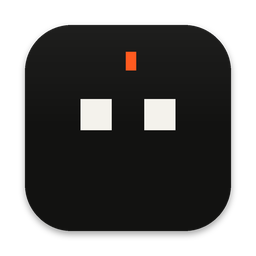
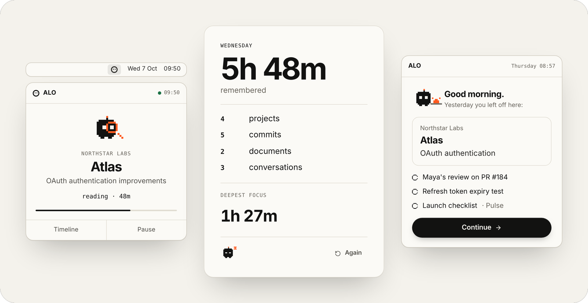
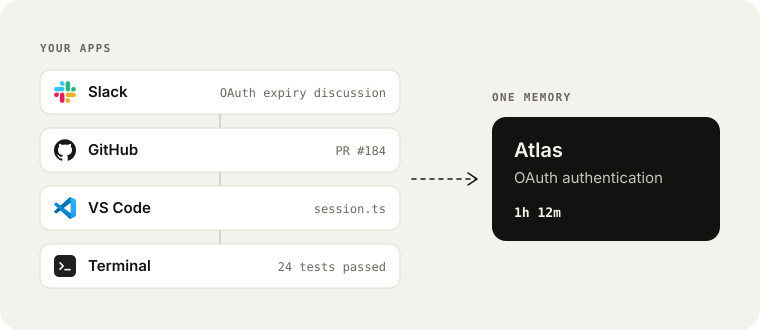
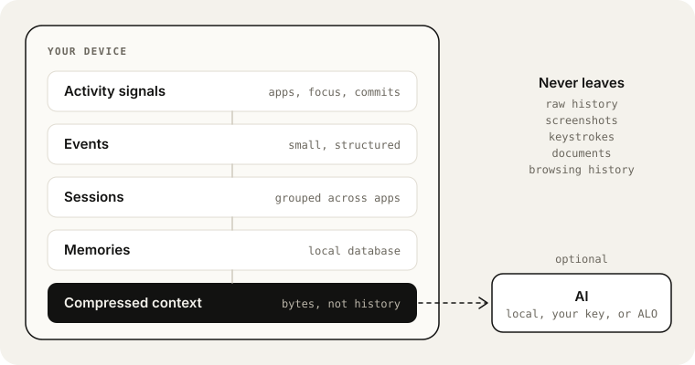
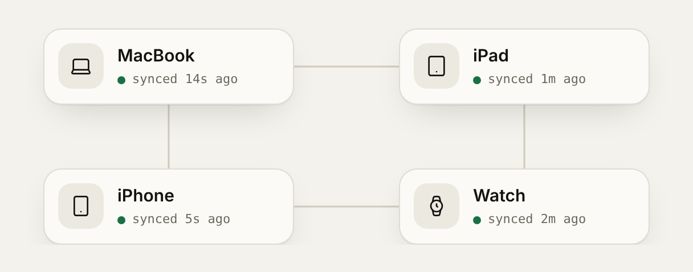
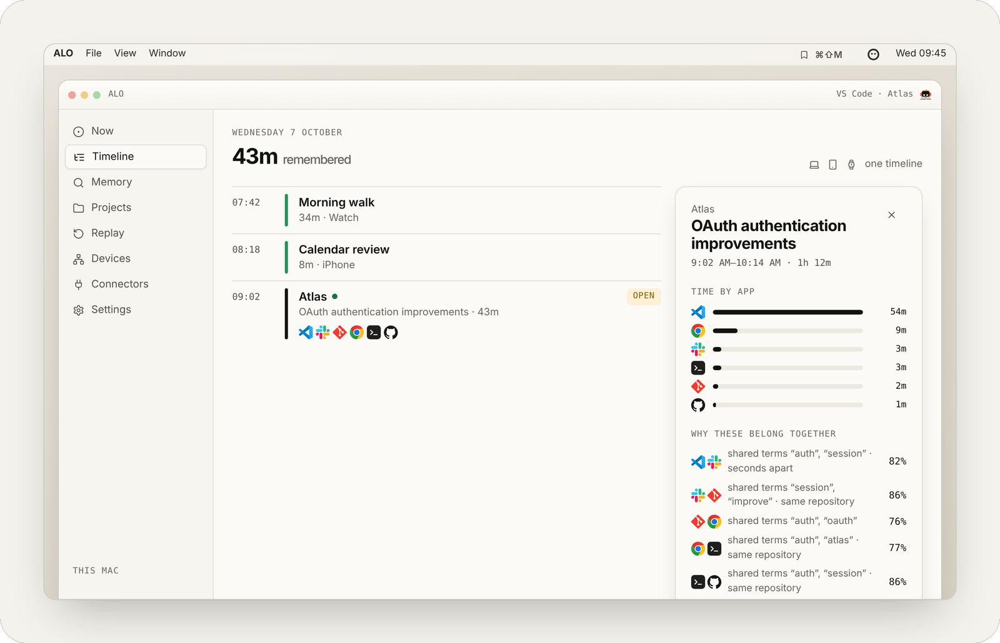
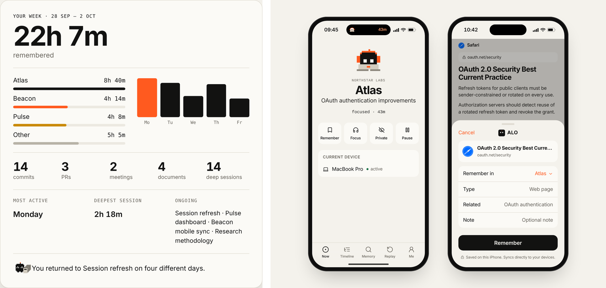

<p align="center">
  
</p>

<h1 align="center">ALO</h1>

<p align="center">
  <strong>Remember what you did.</strong><br />
  Private memory for your digital life.
</p>

<p align="center">
  <a href="https://alo-ebon-two.vercel.app/">Website</a> · <a href="https://github.com/infinitumio/ALO/releases/latest">Download</a> · <a href="https://github.com/infinitumio/ALO/releases">Releases</a>
</p>

<br />



<br />

ALO turns activity across your apps and devices into a private memory of what you did.

Your history stays on your devices. ALO connects the work locally and only sends compressed context when optional AI processing is requested.

<br />

## Remember. Connect. Resume.

| Remember | Connect | Resume |
| --- | --- | --- |
| Turn your day into memory. | See one task across many apps. | Back where you left off. |

<br />

## One task. Many apps.



**ALO sees the work, not just the apps.**

<br />

## Your history stays with you.



```text
Raw activity     Local
Screenshots      Never captured
Keystrokes       Never captured
AI context       Only when requested
```

**ALO knows your day. We don't.**

<br />

## One memory. Every device.



<p align="center">
  <strong>Mac</strong> observes &nbsp;·&nbsp; <strong>iPhone</strong> captures &nbsp;·&nbsp; <strong>iPad</strong> explores &nbsp;·&nbsp; <strong>Watch</strong> remembers
</p>

<br />

## ALO in use





<br />

## Download ALO

**[Download the latest release →](https://github.com/infinitumio/ALO/releases/latest)**

macOS beta &nbsp;·&nbsp; Windows coming later &nbsp;·&nbsp; Linux coming later

Signed public macOS builds are being prepared. Install steps and checksums are in [Releases](./docs/releases.md).

<br />

## About this repository

ALO's application source is currently private. This repository hosts public releases, documentation and integration information.

## ALO Protocol

Apps can describe useful activity directly to ALO using a tiny local event format.

```json
{
  "protocol": "alo/1",
  "type": "task.completed",
  "source": "github",
  "project": "atlas"
}
```

[Read the protocol →](./docs/protocol.md)

## Documentation

[Architecture](./docs/architecture.md) · [Privacy](./docs/privacy.md) · [Protocol](./docs/protocol.md) · [Integrations](./docs/integrations.md) · [Releases](./docs/releases.md)

## Feedback

Bug reports, integration ideas and product feedback are welcome in [Issues](https://github.com/infinitumio/ALO/issues/new/choose). Please do not attach private activity history.

<br />

---

<sub>ALO is proprietary software. See [LICENSE](./LICENSE). · [Security](./SECURITY.md)</sub>
